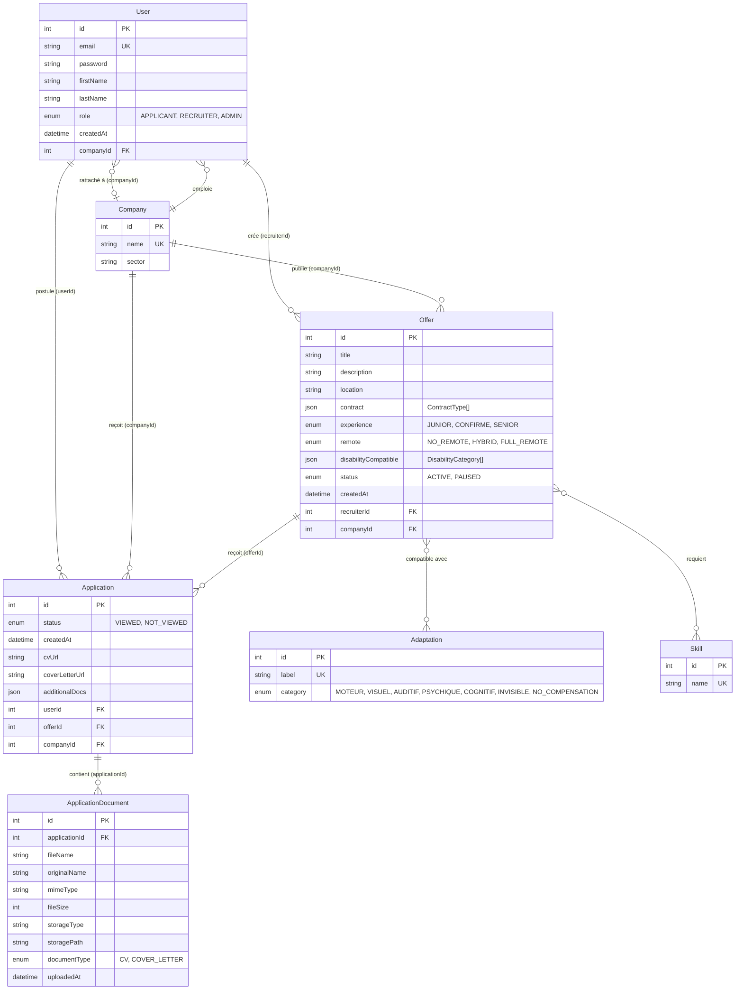

# Diagramme de la Base de Données - Project Handi

## Diagramme ER (Entity-Relationship)

## Description des Tables

### User (Utilisateurs)
- **Rôles** : APPLICANT (candidat), RECRUITER (recruteur), ADMIN (administrateur)
- **Relations** :
  - Peut créer des offres (si RECRUITER)
  - Peut postuler à des offres (si APPLICANT)
  - Peut être rattaché à une entreprise (si RECRUITER)

### Company (Entreprises)
- Stocke les informations des entreprises
- **Relations** :
  - Emploie des recruteurs (User)
  - Publie des offres (Offer)
  - Reçoit des candidatures (Application)

### Offer (Offres d'emploi)
- **Champs JSON** :
  - `contract` : Tableau de types de contrat (CDI, CDD, etc.)
  - `disabilityCompatible` : Tableau de catégories de handicap compatibles
- **Statut** : ACTIVE (visible) ou PAUSED (suspendue)
- **Relations** :
  - Créée par un recruteur (User)
  - Appartient à une entreprise (Company)
  - Reçoit des candidatures (Application)
  - Compatible avec des adaptations (Adaptation)
  - Requiert des compétences (Skill)

### Application (Candidatures)
- **Statut** : VIEWED (consultée) ou NOT_VIEWED (non consultée)
- **Documents** : URLs stockées directement + relation vers ApplicationDocument
- **Relations** :
  - Postulée par un utilisateur (User)
  - Pour une offre (Offer)
  - Liée à une entreprise (Company) pour faciliter les requêtes
  - Contient des documents (ApplicationDocument)

### ApplicationDocument (Documents de candidature)
- Stocke les métadonnées des fichiers uploadés (CV, lettre de motivation)
- **Types** : CV ou COVER_LETTER
- **Stockage** : Agnostique (local ou S3)
- **Relation** : Appartient à une candidature (Application)

### Adaptation (Adaptations)
- Liste des adaptations possibles pour les personnes en situation de handicap
- **Catégories** : MOTEUR, VISUEL, AUDITIF, PSYCHIQUE, COGNITIF, INVISIBLE, NO_COMPENSATION
- **Relation** : Many-to-Many avec Offer

### Skill (Compétences)
- Liste des compétences requises pour les offres
- **Relation** : Many-to-Many avec Offer

## Enums

- **UserRole** : APPLICANT, RECRUITER, ADMIN
- **ContractType** : CDI, CDD, INTERIM, STAGE, ALTERNANCE
- **ExperienceLevel** : JUNIOR, CONFIRME, SENIOR
- **RemotePolicy** : NO_REMOTE, HYBRID, FULL_REMOTE
- **DisabilityCategory** : MOTEUR, VISUEL, AUDITIF, PSYCHIQUE, COGNITIF, INVISIBLE, NO_COMPENSATION
- **ApplicationStatus** : VIEWED, NOT_VIEWED
- **DocumentType** : CV, COVER_LETTER
- **OfferStatus** : ACTIVE, PAUSED
